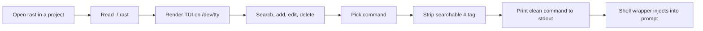

<div align="center">

# ⚡ rast

### A tiny Rust TUI command launcher for your project-local workflows

Save your everyday shell commands, fuzzy-find them in a clean terminal UI, and drop the selected command back into your prompt for review before running it.

[](https://www.rust-lang.org/)
[](https://ratatui.rs/)
[](LICENSE)
[](Cargo.toml)

</div>

---

## ✨ Why rast?

`rast` is for commands you run all the time but still want to inspect before execution:

- `docker compose up -d # start stack`
- `cargo test --all-targets # full test suite`
- `kubectl logs -f deploy/api # api logs`
- `npm run dev # frontend`

Unlike generic fuzzy finders, `rast` is focused on one job: **save commands per project, find them fast, and inject the selected command into your shell prompt instead of executing it blindly.**

```text
┌ search ─────────────────────────────────────────┐
│ ❯ ping google                                   │
└─────────────────────────────────────────────────┘
┌ 2/7 ────────────────────────────────────────────┐
│ ▶ ping -c 5 google.com   # quick connectivity   │
│   ping -c 1 8.8.8.8                             │
└─────────────────────────────────────────────────┘
enter pick · /new add (# tag) · ^e edit · ^d del · esc quit
```

---

## 🚀 Features

| Feature | Details |
|---|---|
| 📁 **Project-local storage** | Commands live in `./.rast`, so every directory can have its own workflow list. |
| 🔎 **Fast fuzzy search** | Space-separated, case-insensitive tokens. Every token must match. |
| 🏷️ **Searchable tags** | Add notes after `#`. Tags are searchable but stripped before shell injection. |
| ✍️ **Inline editing** | Press `Ctrl+E`, tweak the selected command, and save it back. |
| 🛡️ **No surprise execution** | `rast` injects into your shell prompt. You decide when to press Enter. |
| 🐚 **zsh and bash support** | zsh uses `print -z`; bash uses a Readline widget. |
| 🦀 **Small native binary** | Rust, Ratatui, Crossterm. No runtime required. |

---

## 📦 Installation

### One-shot installer

```bash
git clone https://github.com/mukh4w/rast-tui.git
cd rast-tui
./install.sh
```

Then reload your shell config:

```bash
# zsh
source ~/.zshrc

# bash
source ~/.bashrc
```

The installer will:

1. build `rast` in release mode;
2. install the binary to `~/.local/bin/rast` by default;
3. add a zsh wrapper and/or bash widget when matching rc files exist;
4. skip duplicate wrapper installation if it already exists.

> [!TIP]
> You can customize the installation prefix:
>
> ```bash
> PREFIX="$HOME/.cargo" ./install.sh
> ```

### Manual install

```bash
cargo build --release
install -Dm755 target/release/rast ~/.local/bin/rast
```

Make sure `~/.local/bin` is on your `PATH`:

```bash
export PATH="$HOME/.local/bin:$PATH"
```

---

## 🐚 Shell setup

### zsh

Add this to `~/.zshrc`:

```zsh
# rast: TUI fuzzy command picker
rast() {
  local cmd
  cmd="$(command rast)" || return
  [[ -n "$cmd" ]] && print -z -- "$cmd"
}
```

Usage:

```bash
rast
```

The selected command appears in your next prompt.

### bash

Add this to `~/.bashrc`:

```bash
# rast: TUI fuzzy command picker
_rast_widget() {
  local cmd
  cmd="$(command rast </dev/tty)" || return
  if [ -n "$cmd" ]; then
    READLINE_LINE="$cmd"
    READLINE_POINT=${#READLINE_LINE}
  fi
}
bind -x '"\C-g": _rast_widget'
```

Usage:

```text
Ctrl+G
```

The selected command appears at the active prompt.

---

## ⚙️ Usage

Launch `rast` inside any project directory:

```bash
rast
```

### Command actions

| Action | Key / input |
|---|---|
| Search commands | Type normally |
| Add command | `/new <command>` |
| Add command with tag | `/new <command> # <tag>` |
| Pick selected command | `Enter` |
| Edit selected command | `Ctrl+E` |
| Delete selected command | `Ctrl+D` |
| Quit | `Esc` or `Ctrl+C` |

### Navigation

| Action | Key |
|---|---|
| Move up | `↑` or `Ctrl+P` |
| Move down | `↓` or `Ctrl+N` |

### Input editing

| Action | Key |
|---|---|
| Cursor left | `←` or `Ctrl+B` |
| Cursor right | `→` or `Ctrl+F` |
| Start of input | `Home` or `Ctrl+A` |
| End of input | `End` |
| Delete left | `Backspace` |
| Delete right | `Delete` |
| Delete word left | `Ctrl+W` |
| Clear input | `Ctrl+U` |
| Kill to end | `Ctrl+K` |

---

## 🧪 Example workflow

```text
$ cd ~/myproject
$ rast
  > /new docker compose up -d # start stack
  > /new docker compose logs -f api # api logs
  > /new cargo test --all-targets # tests
  esc

$ rast
  > start
  ▶ docker compose up -d   # start stack
  enter

$ docker compose up -d█
```

The command is placed in your prompt. You can edit it, review it, and then press Enter yourself.

Move to another directory and you get a separate command list:

```bash
cd ~/other-project
rast
```

---

## 🧠 How it works



Implementation notes:

- The UI writes directly to `/dev/tty`, keeping `stdout` clean.
- A picked command is printed to `stdout` only after selection.
- zsh captures it and uses `print -z`.
- bash captures it inside a `bind -x` widget and sets `READLINE_LINE`.
- No `TIOCSTI` hacks or unsafe prompt injection are required.

---

## 🧰 Requirements

- Rust **1.88+**
- A Unix-like shell environment
- zsh or bash for prompt injection wrappers

Runtime dependencies are bundled into the native binary by Cargo.

---

## 🗺️ Roadmap

- [ ] Import commands from shell history
- [ ] Optional global command store
- [ ] Export/import command packs
- [ ] Configurable storage filename
- [ ] More shell integrations
- [ ] Demo GIF or screenshots in `assets/`

---

## 📄 License

MIT License. See [LICENSE](LICENSE).

---

<div align="center">

**If `rast` saves you a few keystrokes, consider starring the repo ⭐**

</div>
